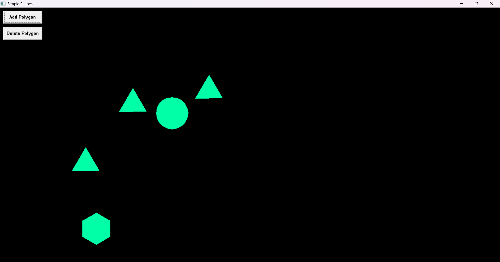

# Polygon Renderer (WINAPI)

A lightweight Windows desktop application for creating and manipulating polygons with a simple graphical interface. Built entirely in C using the Windows API (WINAPI).



## Overview

This application provides an intuitive interface for rendering custom polygons directly on a Windows canvas. Perfect for learning graphics programming, geometric visualization, or creating simple 2D shapes.

## Features

- 🔷 **Polygon Rendering** - Create polygons with up to 20 sides
- ➕ Add/Remove Polygons - Dynamically manage up to 5 shapes (adjustable via MAXPOLYGONS in code)
- 🎨 **Color Customization** - Set polygon colors using HEX values
- 💾 **Save & Load** - Preserve your work and load it later
- 🖱️ **Interactive UI** - Simple buttons and input fields for easy control
- 📐 **Full Customization** - Adjust shape, size, position, and appearance

## Getting Started

### Prerequisites

- GCC compiler (MinGW for Windows)
- Windows OS

### Installation

1. **Clone the repository**
   ```bash
   git clone https://github.com/KhalilAK/Polygon_Renderer-WINAPI.git
   cd Polygon_Renderer-WINAPI
   ```

2. **Compile the application**
   ```bash
   gcc src/program.c -o program.exe -lgdi32
   ```

3. **Run the application**
   ```bash
   program.exe
   ```
   ```bash
   ./program.exe
   ```

   Use ./program.exe if program.exe doesn't work

## Usage

### Creating a Polygon

1. Specify the number of sides (3-20)
2. Set the size and position
3. Choose a color using HEX format (e.g., `#FF5733`)
4. Click "Add Polygon" to render

### Customizing Colors

Use standard HEX color codes:
- `#FF0000` - Red
- `#00FF00` - Green
- `#0000FF` - Blue
- `#FFFFFF` - White
- `#000000` - Black

### Saving Your Work

Automatically saves a .dat file

### Loading Previous Work

Automatically loads the .dat file

## Project Structure

```
Polygon-Renderer-WINAPI/
├── src/
│   └── program.c        # Main application source code
├── screenshots/
    └── screenshot.png         # Application screenshot
├── README.md              # This file
└── program.exe            # Compiled executable (after build)
```

## Technical Details

- **Language**: C
- **API**: Windows API (WINAPI)
- **Graphics**: GDI32 library
- **Architecture**: Single-threaded message-driven Windows application

## How It Works

The application uses the Windows GDI (Graphics Device Interface) to:
1. Create a window with custom controls
2. Handle user input through Windows messages
3. Render polygons using GDI drawing functions
4. Manage polygon data structures in memory

## Examples

### Triangle (3 sides)
```
Sides: 3
Color: #FF0000
Size: 100
```

### Hexagon (6 sides)
```
Sides: 6
Color: #00FFFF
Size: 150
```

### Circle Approximation (20 sides)
```
Sides: 20
Color: #FFD700
Size: 120
```

## Limitations

- Maximum 20 sides per polygon
- Windows-only (requires WINAPI)
- Single window instance


**Made with ❤️ using pure C and WINAPI** | [View on GitHub](https://github.com/KhalilAK/Polygon_Renderer-WINAPI)
